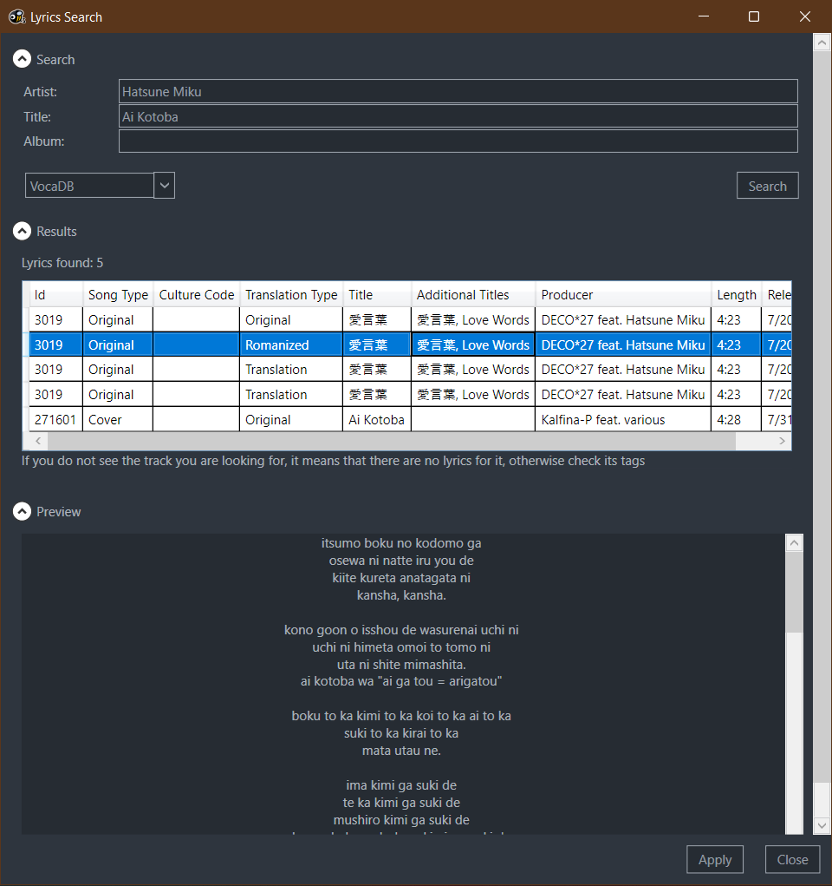
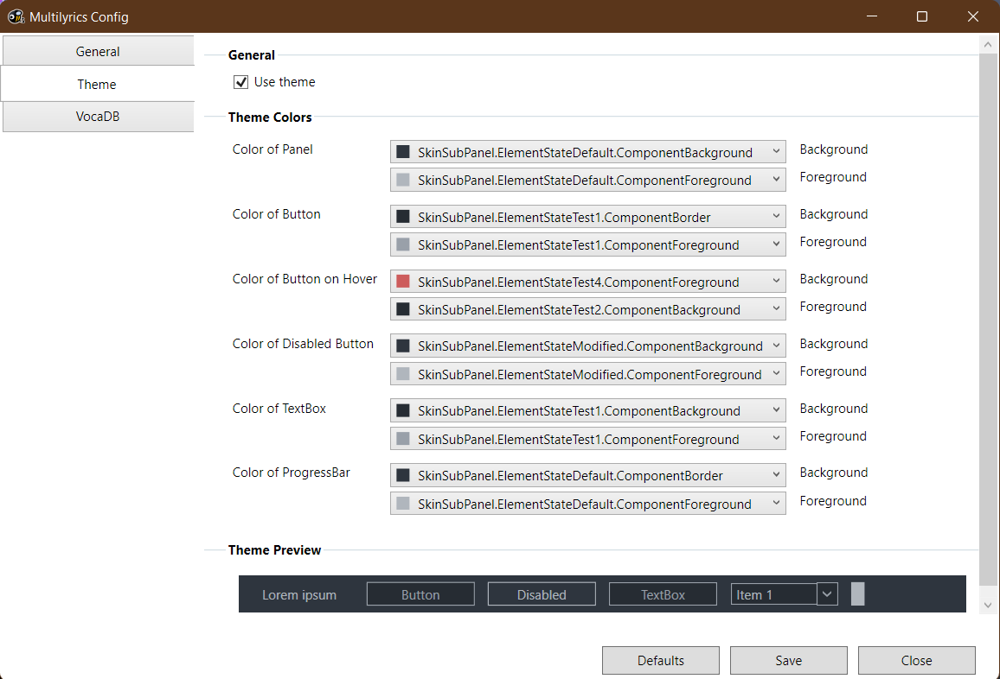

# MultiLyrics
MultiLyrics is an alternative way to retrieve lyrics in MusicBee.  
Especially helpful when there's multiple songs with the same title or multiple lyrics versions.  

# Providers

This plugin uses 'sub-plugins' - providers. It's a .dll file placed in `\MusicBee\Plugins\MultiLyrics_LyricsProviderPlugins`.  
List of known providers:
 - [VocaDB provider](https://github.com/PetrK39/VocaDBMultiLyricsProvider)
   
Make your own with this [Template](https://github.com/PetrK39/MultiLyricsTemplateProvider)

Providers provides lyrics and list of fields that can help to choose necessary lyrics for song.

# Theming

MultiLyrics was build with theming in mind so you can make lyrics search window look seamless to any skin.
Configure plugin to match your skin.  

# Localisation

MultiLyrics currently available with this locales:
 - en-US
 - ru-RU
 
You can help translate the plugin by contributing .resx files of your language
There's list of files you need to provide:
 - WPF\Properties\Resources.your-locale.resx
 - WPF\Views\ConfigView.your-locale.resx
 - WPF\Views\LyricsSearchView.your-locale.resx
 - WPF\Views\LyricsSearchViewControls\ResultsControl.your-locale.resx
  - WPF\Views\LyricsSearchViewControls\SearchControl.your-locale.resx
